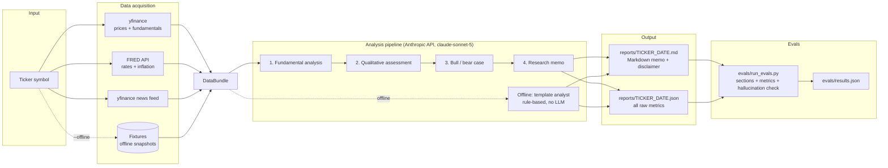

# AI Stock Research Assistant

AI-powered stock research assistant as a CLI tool (plus an optional local web UI).
From a single ticker symbol it produces a structured research memo in the style
of an analyst report — based on price data, fundamentals, macro context and news.

> **Disclaimer:** This project is a tool for informational and educational
> purposes. It provides **no investment advice** and no buy or sell
> recommendations. Every generated report includes a corresponding disclaimer.
> AI-generated analyses can contain errors.

## Features

- **One command, one memo:** `research AAPL` automatically collects all data and
  produces a Markdown memo under `reports/` plus a JSON file with all raw metrics.
- **Data sources:**
  - Price data & fundamentals (valuation, growth, margins, leverage) via **yfinance**
  - Macro context (10Y yield, fed funds rate, CPI inflation, unemployment) via the **FRED API**
  - Recent company news via the **yfinance news feed**
- **Four-stage AI analysis pipeline** (Anthropic API, default model `claude-sonnet-5`):
  1. Fundamental analysis (valuation metrics, growth, margins, leverage)
  2. Qualitative assessment (moat, risks, industry landscape)
  3. Bull case / bear case
  4. Summarizing research memo (executive summary)
- **Deterministic metrics table:** the key-metrics table of every report is
  rendered directly from the raw data (not by the LLM) and is therefore
  guaranteed to be consistent.
- **Offline mode:** `--offline` uses recorded data snapshots and a rule-based
  template analyst — for tests, evals and environments without API keys.
- **Eval suite:** automated quality checks across 10 well-known tickers
  (mandatory sections, metric tolerance check, hallucination check).
- **Optional web UI:** local Flask interface at `http://127.0.0.1:5000`.

## Architecture



## Setup

Requirements: Python ≥ 3.11 and [uv](https://docs.astral.sh/uv/).

```bash
git clone https://github.com/OhneisB/AI-Stock-Research-Assistant.git
cd AI-Stock-Research-Assistant

# Virtual environment + installation
uv venv
uv pip install -e ".[dev]"        # dev includes pytest, reportlab, flask
source .venv/bin/activate

# Configure API keys (never commit them!)
cp .env.example .env
# edit .env: add ANTHROPIC_API_KEY and FRED_API_KEY
```

All secrets are loaded exclusively from environment variables or the local
`.env` file (python-dotenv). `.env` is excluded via `.gitignore`.

## Usage

```bash
research AAPL                  # standard analysis for Apple
research AAPL --deep           # more detailed analysis (longer sections)
research --compare AAPL MSFT   # comparison report across both tickers
research AAPL --offline        # offline mode (fixtures + template analyst)
research AAPL --out ./memos    # custom output directory
```

Output per ticker:

- `reports/AAPL_YYYY-MM-DD.md` — structured research memo with disclaimer,
  executive summary, key-metrics table, macro environment, fundamental
  analysis, qualitative assessment, bull/bear case and news
- `reports/AAPL_YYYY-MM-DD.json` — all raw metrics, macro data, news and the
  generated sections (machine-readable)

Without an `ANTHROPIC_API_KEY` the tool automatically falls back to the
rule-based offline analyst (with a clear note in the report).

### Web UI (optional)

```bash
python -m stock_research.webapp
# then open http://127.0.0.1:5000 in your browser
```

## Validation (eval suite)

Instead of a classic backtest, the eval suite checks the **quality of the
generated reports** across 10 well-known tickers (AAPL, MSFT, GOOGL, AMZN,
NVDA, META, TSLA, JPM, JNJ, XOM):

| Check | Criterion |
|---|---|
| (a) Sections | All mandatory sections and the disclaimer are present in the Markdown |
| (b) Metrics | Values in the key-metrics table match the yfinance raw data (relative tolerance 0.5 % + rounding tolerance) |
| (c) Hallucinations | Every number in the analyst text can be traced back to a raw-data value (relative tolerance 5 %) |

```bash
python evals/run_evals.py          # offline (fixtures + template analyst)
python evals/run_evals.py --live   # live (yfinance/FRED + Anthropic API)
```

**Current result** (committed run, see [`evals/results.json`](evals/results.json)):
**10/10 tickers passed (pass rate 100 %)** — all mandatory sections present,
all checked metrics within tolerance, no unsubstantiated numbers.

*Transparency note:* The committed run was produced in **offline mode**
(recorded data snapshots + deterministic template analyst) because the build
environment had no access to Yahoo/FRED/Anthropic. It validates the complete
pipeline mechanics including all three checks. With your own API keys the same
run can be repeated at any time with `--live` against the real Anthropic API
and live data; the checks are identical and are designed precisely for the LLM
case (hallucination check).

## Tests & CI

```bash
pytest            # 22 unit/integration tests, fully runnable offline
```

The tests cover data parsing (yfinance info, FRED observations, both yfinance
news formats), metric formatting, report generation, the CLI and the eval
checks. A GitHub Actions workflow
([`.github/workflows/tests.yml`](.github/workflows/tests.yml)) runs them on
every push and pull request.

## Project structure

```
src/stock_research/
├── cli.py              # CLI: research TICKER [--deep] [--compare] [--offline]
├── config.py           # settings from environment variables / .env
├── report.py           # Markdown memo + JSON raw data
├── evalchecks.py       # quality checks (sections, metrics, hallucinations)
├── webapp.py           # optional Flask web UI
├── data/
│   ├── market.py       # yfinance: prices + fundamentals (+ parsing)
│   ├── macro.py        # FRED API: rates, inflation, labor market
│   ├── news.py         # yfinance news feed (old + new format)
│   ├── collect.py      # DataBundle collector (live / fixture)
│   └── models.py       # data models
└── analysis/
    ├── prompts.py      # prompt building blocks of the 4 pipeline stages
    ├── pipeline.py     # ClaudeAnalyst (Anthropic API) + TemplateAnalyst (offline)
    └── formatting.py   # deterministic metric formatting

evals/                  # eval suite, fixtures and results.json
tests/                  # pytest suite (offline)
scripts/generate_pdf.py # generates the PDF documentation (reportlab)
```

### PDF documentation

The detailed PDF documentation is not versioned in the repository — generate it
locally when needed:

```bash
python scripts/generate_pdf.py   # writes docs/documentation.pdf (gitignored)
```

## Limitations

- **Not investment advice.** The reports are automatically generated texts,
  not audited financial analysis.
- **Data quality:** yfinance uses unofficial Yahoo Finance endpoints; metrics
  can be missing, delayed or wrong (especially for banks / non-US stocks).
  Missing values appear as `n/a`.
- **LLM limits:** despite strict prompts and the hallucination check, the
  model can misinterpret relationships. The check validates numbers, not the
  logic of the argument.
- **Macro context is US-centric** (FRED series: DGS10, FEDFUNDS, CPIAUCSL, UNRATE).
- **No backtest / no predictive power:** the eval suite measures report quality
  and data consistency, not the forecasting quality of the analyses.
- **Offline fixtures are illustrative** and not current — always use live mode
  for real analyses.

## License

MIT — see [LICENSE](LICENSE).
