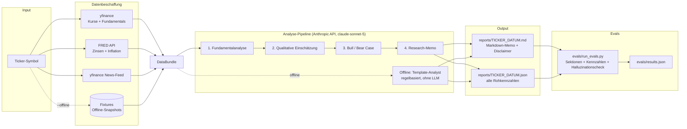

# AI Stock Research Assistant

KI-gestützter Aktien-Research-Assistent als CLI-Tool (plus optionalem lokalem Web-UI).
Aus einem Ticker-Symbol entsteht ein strukturiertes Research-Memo im Stil eines
Analysten-Reports – auf Basis von Kursdaten, Fundamentals, Makro-Kontext und News.

> **Disclaimer:** Dieses Projekt ist ein Werkzeug zu Informations- und
> Ausbildungszwecken. Es liefert **keine Anlageberatung** und keine Kauf- oder
> Verkaufsempfehlungen. Jeder generierte Report enthält einen entsprechenden
> Disclaimer. KI-generierte Analysen können Fehler enthalten.

## Features

- **Ein Befehl, ein Memo:** `research AAPL` sammelt automatisch alle Daten und
  erzeugt ein Markdown-Memo unter `reports/` plus eine JSON-Datei mit allen Rohkennzahlen.
- **Datenquellen:**
  - Kursdaten & Fundamentals (Bewertung, Wachstum, Margen, Verschuldung) via **yfinance**
  - Makro-Kontext (10J-Rendite, Leitzins, CPI-Inflation, Arbeitslosenquote) via **FRED API**
  - Aktuelle Unternehmens-News via **yfinance-News-Feed**
- **Vierstufige KI-Analyse-Pipeline** (Anthropic API, Default-Modell `claude-sonnet-5`):
  1. Fundamentalanalyse (Bewertungskennzahlen, Wachstum, Margen, Verschuldung)
  2. Qualitative Einschätzung (Moat, Risiken, Branchenlage)
  3. Bull Case / Bear Case
  4. Zusammenfassendes Research-Memo (Executive Summary)
- **Deterministische Kennzahlen-Tabelle:** Die Kennzahlenübersicht jedes Reports wird
  direkt aus den Rohdaten gerendert (nicht vom LLM) und ist damit garantiert konsistent.
- **Offline-Modus:** `--offline` nutzt aufgezeichnete Daten-Snapshots und einen
  regelbasierten Template-Analysten – für Tests, Evals und Umgebungen ohne API-Keys.
- **Eval-Suite:** automatisierte Qualitätsprüfung über 10 bekannte Ticker
  (Pflicht-Sektionen, Kennzahlen-Toleranzprüfung, Halluzinations-Check).
- **Optionales Web-UI:** lokales Flask-Interface unter `http://127.0.0.1:5000`.

## Architektur



## Setup

Voraussetzungen: Python ≥ 3.11 und [uv](https://docs.astral.sh/uv/).

```bash
git clone https://github.com/OhneisB/ai-stock-research-assistant.git
cd ai-stock-research-assistant

# Virtuelle Umgebung + Installation
uv venv
uv pip install -e ".[dev]"        # dev enthält pytest, reportlab, flask
source .venv/bin/activate

# API-Keys konfigurieren (niemals committen!)
cp .env.example .env
# .env editieren: ANTHROPIC_API_KEY und FRED_API_KEY eintragen
```

Alle Secrets werden ausschließlich über Umgebungsvariablen bzw. die lokale
`.env`-Datei geladen (python-dotenv). `.env` ist per `.gitignore` ausgeschlossen.

## Usage

```bash
research AAPL                  # Standard-Analyse für Apple
research AAPL --deep           # ausführlichere Analyse (längere Sektionen)
research --compare AAPL MSFT   # Vergleichsreport über beide Ticker
research AAPL --offline        # Offline-Modus (Fixtures + Template-Analyst)
research AAPL --out ./memos    # eigenes Zielverzeichnis
```

Ausgabe pro Ticker:

- `reports/AAPL_YYYY-MM-DD.md` – strukturiertes Research-Memo mit Disclaimer,
  Executive Summary, Kennzahlenübersicht, Makro-Umfeld, Fundamentalanalyse,
  qualitativer Einschätzung, Bull/Bear Case und News
- `reports/AAPL_YYYY-MM-DD.json` – alle Rohkennzahlen, Makro-Daten, News und
  die generierten Sektionen (maschinenlesbar)

Ohne gesetzten `ANTHROPIC_API_KEY` fällt das Tool automatisch auf den
regelbasierten Offline-Analysten zurück (mit deutlichem Hinweis im Report).

### Web-UI (optional)

```bash
python -m stock_research.webapp
# dann im Browser: http://127.0.0.1:5000
```

## Validierung (Eval-Suite)

Statt eines klassischen Backtests prüft die Eval-Suite die **Qualität der
generierten Reports** über 10 bekannte Ticker (AAPL, MSFT, GOOGL, AMZN, NVDA,
META, TSLA, JPM, JNJ, XOM):

| Check | Kriterium |
|---|---|
| (a) Sektionen | Alle Pflicht-Sektionen und der Disclaimer sind im Markdown enthalten |
| (b) Kennzahlen | Werte der Kennzahlenübersicht stimmen mit den yfinance-Rohdaten überein (relative Toleranz 0.5 % + Rundungstoleranz) |
| (c) Halluzinationen | Jede Zahl im Analysten-Text lässt sich auf einen Rohdatenwert zurückführen (relative Toleranz 5 %) |

```bash
python evals/run_evals.py          # offline (Fixtures + Template-Analyst)
python evals/run_evals.py --live   # live (yfinance/FRED + Anthropic API)
```

**Aktuelles Ergebnis** (committeter Lauf, siehe [`evals/results.json`](evals/results.json)):
**10/10 Ticker bestanden (Trefferquote 100 %)** – alle Pflicht-Sektionen vorhanden,
alle geprüften Kennzahlen innerhalb der Toleranz, keine unbelegten Zahlen.

*Transparenz-Hinweis:* Der committete Lauf wurde im **Offline-Modus** erzeugt
(aufgezeichnete Daten-Snapshots + deterministischer Template-Analyst), da die
Build-Umgebung keinen Zugriff auf Yahoo/FRED/Anthropic hatte. Er validiert die
komplette Pipeline-Mechanik inklusive aller drei Checks. Mit eigenen API-Keys
lässt sich derselbe Lauf jederzeit mit `--live` gegen die echte Anthropic API
und Live-Daten wiederholen; die Checks sind identisch und gerade für den
LLM-Fall gedacht (Halluzinations-Check).

## Tests & CI

```bash
pytest            # 22 Unit-/Integrationstests, komplett offline lauffähig
```

Die Tests decken Datenparsing (yfinance-Info, FRED-Observations, beide
yfinance-News-Formate), Kennzahlen-Formatierung, Report-Generierung, CLI und
die Eval-Checks ab. Ein GitHub-Actions-Workflow
([`.github/workflows/tests.yml`](.github/workflows/tests.yml)) führt sie bei
jedem Push und Pull Request aus.

## Projektstruktur

```
src/stock_research/
├── cli.py              # CLI: research TICKER [--deep] [--compare] [--offline]
├── config.py           # Settings aus Umgebungsvariablen / .env
├── report.py           # Markdown-Memo + JSON-Rohdaten
├── evalchecks.py       # Qualitätschecks (Sektionen, Kennzahlen, Halluzinationen)
├── webapp.py           # optionales Flask-Web-UI
├── data/
│   ├── market.py       # yfinance: Kurse + Fundamentals (+ Parsing)
│   ├── macro.py        # FRED API: Zinsen, Inflation, Arbeitsmarkt
│   ├── news.py         # yfinance-News-Feed (altes + neues Format)
│   ├── collect.py      # DataBundle-Sammler (live / Fixture)
│   └── models.py       # Datenmodelle
└── analysis/
    ├── prompts.py      # Prompt-Bausteine der 4 Pipeline-Stufen
    ├── pipeline.py     # ClaudeAnalyst (Anthropic API) + TemplateAnalyst (offline)
    └── formatting.py   # deterministische Kennzahlen-Formatierung

evals/                  # Eval-Suite, Fixtures und results.json
tests/                  # pytest-Suite (offline)
docs/dokumentation.pdf  # ausführliche deutsche Dokumentation
scripts/generate_pdf.py # erzeugt die PDF-Doku (reportlab)
```

## Limitationen

- **Keine Anlageberatung.** Die Reports sind automatisiert erzeugte Texte, keine
  geprüfte Finanzanalyse.
- **Datenqualität:** yfinance nutzt inoffizielle Yahoo-Finance-Schnittstellen;
  Kennzahlen können fehlen, verzögert oder fehlerhaft sein (insbesondere bei
  Banken/Nicht-US-Werten). Fehlende Werte erscheinen als `n/a`.
- **LLM-Grenzen:** Trotz strikter Prompts und Halluzinations-Check kann das
  Modell Zusammenhänge falsch interpretieren. Der Check prüft Zahlen, nicht
  Argumentationslogik.
- **Makro-Kontext ist US-zentriert** (FRED-Serien: DGS10, FEDFUNDS, CPIAUCSL, UNRATE).
- **Kein Backtest / keine Prognosegüte:** Die Eval-Suite misst Report-Qualität
  und Datenkonsistenz, nicht die Vorhersagekraft der Analysen.
- **Offline-Fixtures sind illustrativ** und nicht aktuell – für echte Analysen
  immer den Live-Modus verwenden.

## Lizenz

MIT – siehe [LICENSE](LICENSE).
